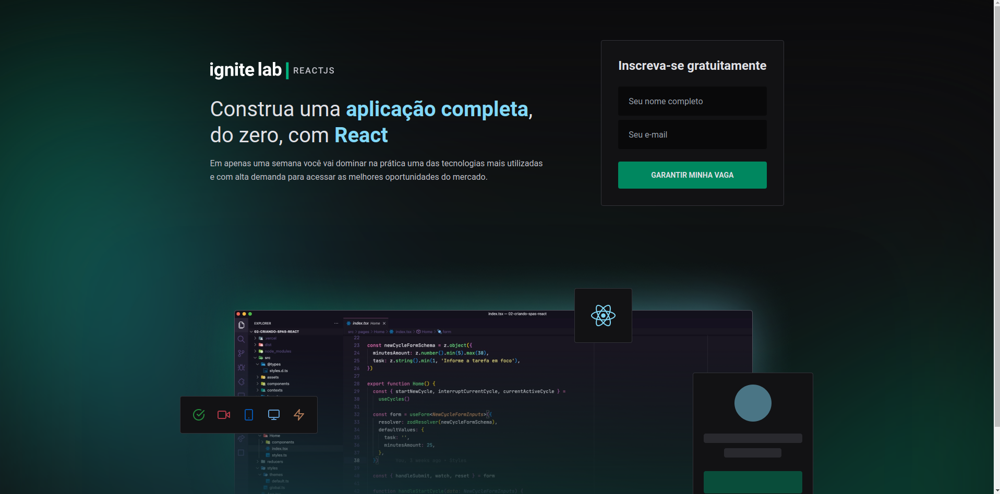
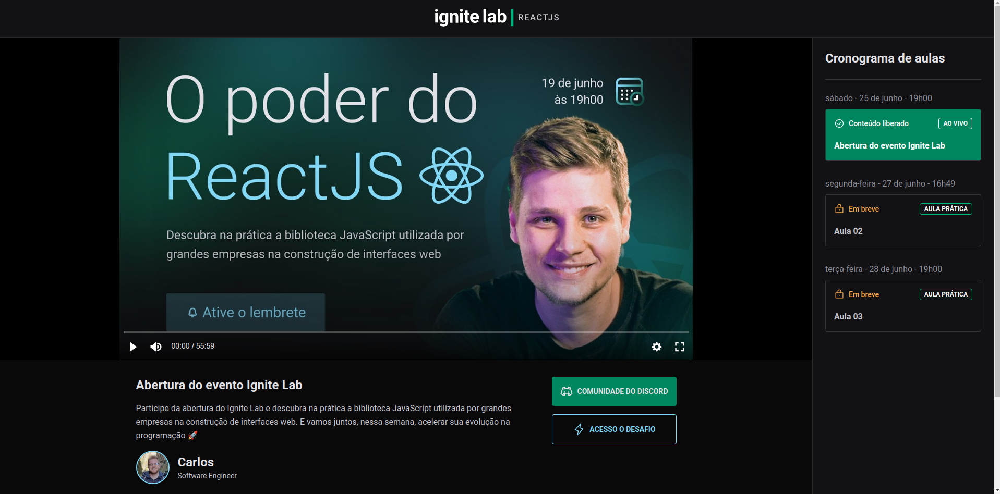

# Ignite Lab - Event Platform

This is a web application to show a list of videos of an event and the user can subscribe to this event. The information that are shown in the application is created using GraphCMS.


## Screenshots





## Run Locally

Clone the project

```bash
  git clone https://github.com/carloshkruger/ignite-lab-event-platform.git
```

Go to the project directory

```bash
  cd ignite-lab-event-platform
```

Install dependencies

```bash
  npm install
```

Start the application

```bash
  npm run dev
```


## Tech Stack

**Client:** React, TailwindCSS, GraphQL, Apollo GraphQL, GraphQL Codegen, TypeScript, Vite


